# HR-GenAI: Asisten Hukum Ketenagakerjaan Indonesia

<p align="center">
  
</p>

<p align="center">
  Asisten AI Pintar untuk Membantu Memahami dan Menerapkan Hukum Ketenagakerjaan Indonesia
</p>

<p align="center">
  <a href="#fitur"><strong>Fitur</strong></a> ·
  <a href="#dataset"><strong>Dataset</strong></a> ·
  <a href="#instalasi"><strong>Instalasi</strong></a> ·
  <a href="#penggunaan-lokal"><strong>Penggunaan Lokal</strong></a>
</p>

<p align="center">
  <a href="https://opensource.org/licenses/MIT">
    
  </a>
  <a href="https://github.com/yourusername/hr-genai/issues">
    
  </a>
  <a href="https://github.com/yourusername/hr-genai/network">
    
  </a>
</p>

## 🚀 Demo

Kunjungi [hr-genai.vercel.app](https://hr-genai.vercel.app) untuk mencoba aplikasi secara langsung.

## 🔄 Alur Kerja Sistem

<p align="center">
  
</p>
## ✨ Fitur

### 📋 Analisis Hukum Ketenagakerjaan

- 📝 Analisis kontrak kerja (PKWT/PKWTT)
- 🧮 Perhitungan pesangon otomatis sesuai UU
- 📊 Evaluasi kebijakan perusahaan
- 📚 Referensi UU yang relevan

### 💻 Teknologi Modern

- ⚡️ [Next.js](https://nextjs.org) App Router untuk performa optimal
- 🤖 [AI SDK](https://sdk.vercel.ai/docs) untuk generasi teks dan analisis
- 🧠 [OpenAI GPT-4](https://openai.com) untuk pemahaman konteks yang mendalam
- 🎨 Antarmuka responsif dengan [Tailwind CSS](https://tailwindcss.com)

### 🔒 Fitur Keamanan & Penyimpanan

- 🔑 Autentikasi aman dengan [NextAuth.js](https://github.com/nextauthjs/next-auth)
- 💾 Penyimpanan data dengan [Vercel Postgres](https://vercel.com/storage/postgres)
- 📁 Pengelolaan dokumen dengan [Vercel Blob](https://vercel.com/storage/blob)

## 📊 Dataset

Dataset lengkap yang digunakan dalam proyek ini dapat diakses di:
[drive.com](https://drive.com)

Dataset mencakup:

- 📜 Undang-Undang Ketenagakerjaan Indonesia
- 📋 Peraturan Pemerintah terkait
- 📝 Contoh kasus dan penyelesaiannya
- 📄 Templat dokumen HR standar

## 🛠️ Instalasi

1. Clone repositori

```bash
git clone https://github.com/yourusername/hr-genai.git
```

2. Install dependensi

```bash
pnpm install
```

3. Siapkan environment variables

```bash
cp .env.example .env.local
```

## 🔑 Environment Variables

```env
# Authentication
AUTH_SECRET=your-auth-secret

# OpenAI
OPENAI_API_KEY=your-openai-api-key

# Database
POSTGRES_URL=your-postgres-url

# Storage
BLOB_READ_WRITE_TOKEN=your-blob-token
```

## 🤝 Kontribusi

Kami sangat menghargai kontribusi Anda! Silakan buat pull request atau laporkan issues jika menemukan bug atau memiliki saran peningkatan.

1. Fork repositori ini
2. Buat branch baru (`git checkout -b feature/..`)
3. Commit perubahan Anda (`git commit -m 'New Fix'`)
4. Push ke branch (`git push origin feature/..`)
5. Buat Pull Request

## 📝 Lisensi

Didistribusikan di bawah Lisensi MIT. Lihat `LICENSE` untuk informasi lebih lanjut.

## 👥 Tim

- Ir. Galih Wasis Wicaksono, S.Kom, M.Cs
- Nur Putri Hidayah, A.Md., SH., MH.
- Muh. Ridha Agam

## 🙏 All softwares used:

- [Next.js](https://nextjs.org)
- [Vercel AI SDK](https://sdk.vercel.ai/docs)
- [Tailwind CSS](https://tailwindcss.com)
- [NextAuth.js](https://next-auth.js.org)
